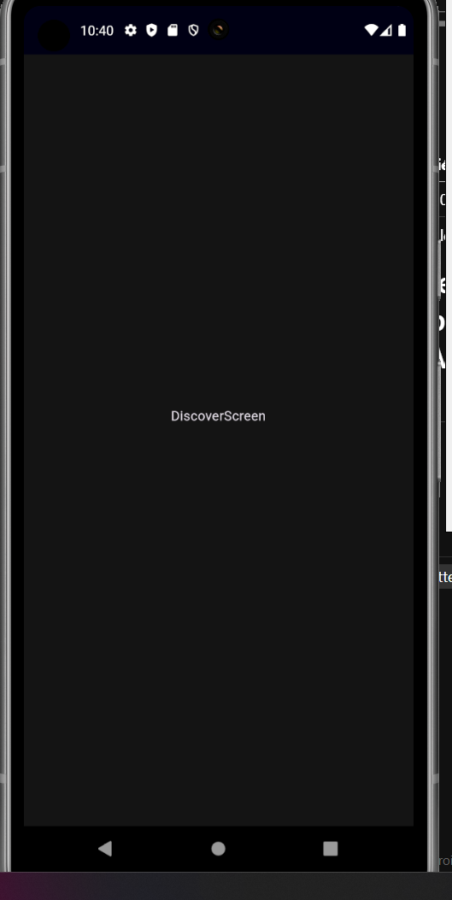

# DMI-10A-230893-TOKTIK
Aplicación realizada en Flutter para Dispositivos Móviles para la unidad 3 de la asignatura de Desarrollo Móvil Integral, que emula la producción vertical de videos.

---

**DESCRIPCIÓN**
PROYECTO DE CLASE PARA LA UNIDAD 2 DE LA ASIGNATURA DE DESARROLLO MOVIL INTEGRAL (DMI) IMPARTIDA POR EL M.T.I MARCO A. RAMIREZ HERNANDEZ

### HISTORIAL DE PRACTICAS
|NO.|NOMBRE|POTENCIADOR|ESTATUS|
|--|--|--|--|
|24|Creación del Proyecto y Modelo de Datos para App de Reproducción de Videos Verticales (Clon TokTik) |8|⭐ACTIVA|

### LISTA DE HERRAMIENTAS

## Herramientas Utilizadas
- **Dart**: Lenguaje de programación utilizado para desarrollar aplicaciones Flutter.
- **Flutter**: Framework para crear aplicaciones nativas de forma rápida.

### AUTOR
ELABORADO POR BRAYAN GUTIERREZ RAMIREZ [@BrayanG02](https://github.com/BrayanG02)

    
    

     

| **Nombre del estudiante** | Brayan Gutiérrez Ramírez |
|:-------------------------:|:------------------------------:|
| **Matrícula**             | 230893                         |
| **Carrera**               | Ingeniería en Desarrollo y Gestión de Software |

# PRACTICA 24: Creación del Proyecto y Modelo de Datos para App de Reproducción de Videos Verticales (Clon TokTik)

# RESULTADO DE LA PRÁCTICA
| Imagen 1               | 
|------------------------|
|  |